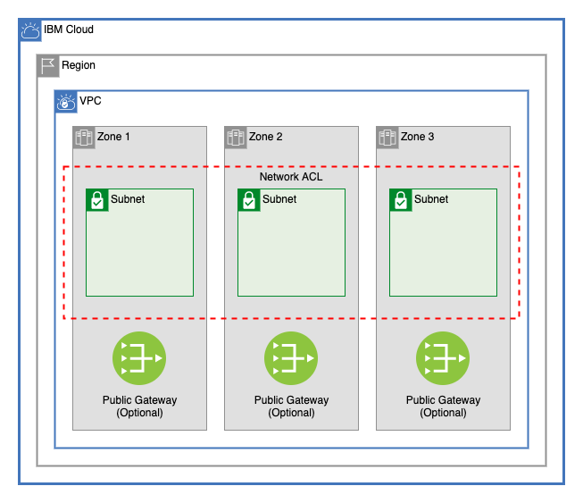

# GCAT Multizone VPC

This module creates a VPC with subnets across 1, 2, or 3 zones, a network ACL, and optionall creates public gateways in those zones.



---

## Table of Contents

1. [VPC](##vpc)
2. [Public Gateways](##public-gateways)
3. [Network ACL](##network-acl)
4. [Subnets](##subnets)
5. [Module Variables](##Module-Variables)
6. [Module Outputs](##Module-Outputs)
7. [As A Module in a Larger Architecture](##As-A-Module-in-a-Larger-Architecture)

---

## VPC

This module creates a VPC in a resource group with optional Classic Access. It also allows users to update the default vpc security group with additional rules.

### Default Security Group Rules

Default security group rules are converted from a list to an object to ensure that adding, deleting, or changing the order of rules listed will not force unwanted changes. Example:

```terraform
ibm_is_security_group_rule.default_vpc_rule["allow-inbound-ping"]
ibm_is_security_group_rule.default_vpc_rule["allow-inbound-ssh"]
```

---

## Public Gateways

This module allows a user to optionally create public gateways in the VPC in each of the three zones of the VPC's region.

---

## Network ACL

This module creates a network ACL with any number of rules. *(Note: by default, VPC Network ACLs have a maximum of 25 rules.)*
Any subnets created by this module will be connected to this ACL

## Subnets

The [subnet module](./subnet) allows users to create subnets in 1, 2, or 3 zones. Public gateways can be optionally attached to each subnet.

### Address Prefixes

A CIDR block is created in the VPC for each subnet that will be provisioned

### Subnets

The type of the `subnets` variable is as follows:

```terraform
object({
    zone-1 = list(object({
      name           = string
      cidr           = string
      public_gateway = optional(bool)
    }))
    zone-2 = list(object({
      name           = string
      cidr           = string
      public_gateway = optional(bool)
    }))
    zone-3 = list(object({
      name           = string
      cidr           = string
      public_gateway = optional(bool)
    }))
  })
```

While `zone-1`, `zone-2`, and `zone-3` are all lists, these lists are converted into an object before the resources are provisioned. This ensures that the addition or deletion of subnets will affect only the added or deleted subnets. Example:

```terraform
module.subnets.ibm_is_subnet.subnet["gcat-multizone-subnet-a"]
module.subnets.ibm_is_subnet.subnet["gcat-multizone-subnet-b"]
module.subnets.ibm_is_subnet.subnet["gcat-multizone-subnet-c"]
module.subnets.ibm_is_vpc_address_prefix.subnet_prefix["gcat-multizone-subnet-a"]
module.subnets.ibm_is_vpc_address_prefix.subnet_prefix["gcat-multizone-subnet-b"]
module.subnets.ibm_is_vpc_address_prefix.subnet_prefix["gcat-multizone-subnet-c"]
```

---

## Module Variables

Name                 | Type                                                                                                                                                                                                                                                                                                                                                                                                                                                                                                             | Description                                                                         | Sensitive | Default
-------------------- | ---------------------------------------------------------------------------------------------------------------------------------------------------------------------------------------------------------------------------------------------------------------------------------------------------------------------------------------------------------------------------------------------------------------------------------------------------------------------------------------------------------------- | ----------------------------------------------------------------------------------- | --------- | -----------------------------------------------------------------------------------------------------------------------------------------------------------------------------------------------------------------------------------------------------------------------------------------------
ibmcloud_api_key     | string                                                                                                                                                                                                                                                                                                                                                                                                                                                                                                           | The IBM Cloud platform API key needed to deploy IAM enabled resources               | true      | 
prefix               | string                                                                                                                                                                                                                                                                                                                                                                                                                                                                                                           | A unique identifier need to provision resources. Must begin with a letter           |           | gcat-multizone
region               | string                                                                                                                                                                                                                                                                                                                                                                                                                                                                                                           | Region where VPC will be created                                                    |           | us-south
resource_group       | string                                                                                                                                                                                                                                                                                                                                                                                                                                                                                                           | Name of resource group where all infrastructure will be provisioned                 |           | asset-development
classic_access       | bool                                                                                                                                                                                                                                                                                                                                                                                                                                                                                                             | Enable VPC Classic Access. Note: only one VPC per region can have classic access    |           | false
subnets              | object({ zone-1 = list(object({ name = string cidr = string public_gateway = optional(bool) })) zone-2 = list(object({ name = string cidr = string public_gateway = optional(bool) })) zone-3 = list(object({ name = string cidr = string public_gateway = optional(bool) })) })                                                                                                                                                                                                                                 | List of subnets for the vpc. For each item in each array, a subnet will be created. |           | {<br>zone-1 = [{<br>name = "subnet-a"<br>cidr = "10.10.10.0/24"<br>public_gateway = true<br>}],<br>zone-2 = [{<br>name = "subnet-b"<br>cidr = "10.20.10.0/24"<br>public_gateway = true<br>}],<br>zone-3 = [{<br>name = "subnet-c"<br>cidr = "10.30.10.0/24"<br>public_gateway = true<br>}]<br>}
use_public_gateways  | object({ zone-1 = optional(bool) zone-2 = optional(bool) zone-3 = optional(bool) })                                                                                                                                                                                                                                                                                                                                                                                                                              | Create a public gateway in any of the three zones with `true`.                      |           | {<br>zone-1 = true<br>zone-2 = true<br>zone-3 = true<br>}
acl_rules            | list( object({ name = string action = string destination = string direction = string source = string tcp = optional( object({ port_max = optional(number) port_min = optional(number) source_port_max = optional(number) source_port_min = optional(number) }) ) udp = optional( object({ port_max = optional(number) port_min = optional(number) source_port_max = optional(number) source_port_min = optional(number) }) ) icmp = optional( object({ type = optional(number) code = optional(number) }) ) }) ) | Access control list rule set                                                        |           | [<br>{<br>name = "allow-all-inbound"<br>action = "allow"<br>direction = "inbound"<br>destination = "0.0.0.0/0"<br>source = "0.0.0.0/0"<br>},<br>{<br>name = "allow-all-outbound"<br>action = "allow"<br>direction = "outbound"<br>destination = "0.0.0.0/0"<br>source = "0.0.0.0/0"<br>}<br>]
security_group_rules | list( object({ name = string direction = string remote = string tcp = optional( object({ port_max = optional(number) port_min = optional(number) }) ) udp = optional( object({ port_max = optional(number) port_min = optional(number) }) ) icmp = optional( object({ type = optional(number) code = optional(number) }) ) }) )                                                                                                                                                                                  | A list of security group rules to be added to the default vpc security group        |           | [<br>{<br>name = "allow-inbound-ping"<br>direction = "inbound"<br>remote = "0.0.0.0/0"<br>icmp = {<br>type = 8<br>}<br>},<br>{<br>name = "allow-inbound-ssh"<br>direction = "inbound"<br>remote = "0.0.0.0/0"<br>tcp = {<br>port_min = 22<br>port_max = 22<br>}<br>},<br>]

---

## Module Outputs

Description                                                 | Value
----------------------------------------------------------- | --------------------------------
ID of VPC created                                           | ibm_is_vpc.vpc.id
ID of ACL created for subnets                               | ibm_is_network_acl.multizone_acl
Public gateways created                                     | local.public_gateways
The IDs of the subnets                                      | module.subnets.ids
A list of subnets containing names, CIDR blocks, and zones. | module.subnets.detail_list
A list containing subnet IDs and subnet zones               | module.subnets.zone_list

---

## As A Module in a Larger Architecture

```terraform
module multizone_vpc {
  source               = "./multizone_vpc"
  ibmcloud_api_key     = var.ibmcloud_api_key
  prefix               = var.prefix
  region               = var.region
  resource_group       = var.resource_group
  classic_access       = var.classic_access
  subnets              = var.subnets
  use_public_gateways  = var.use_public_gateways
  acl_rules            = var.acl_rules
  security_group_rules = var.security_group_rules
}
```
